# CERTUS_mycode

This repository contains code and instructions for working with the [Aslan autonomous driving simulator](https://github.com/project-aslan/Aslan?tab=readme-ov-file), custom worlds, SLAM mapping, Octomap/NDT mapping, and lane detection for a simulated Twizy vehicle.

---

## Requirements

* Ubuntu 18.04 LTS
* ROS 1 Melodic [ros-melodic-desktop-full](https://wiki.ros.org/melodic/Installation/Ubuntu)
* Catkin Command Line Tools [catkin_tools](https://catkin-tools.readthedocs.io/en/latest/installing.html)
* Python 2

## Aslan Setup

Clone and enter the [Aslan repo](https://github.com/project-aslan/Aslan?tab=readme-ov-file):

```bash
cd Aslan/

# Start the Aslan stack
./run
```

Launch a simulation world:

```bash
# Launch the custom simulation world
roslaunch sd_robot sd_twizy_worlds.launch world:=custom

# Or use a predefined scenario
roslaunch sd_robot sd_twizy_worlds.launch world:=car_1_junction

# View camera stream from the front center camera
/sd_twizy/front_center_camera/image_raw
```

## Worlds

### `harbour world`
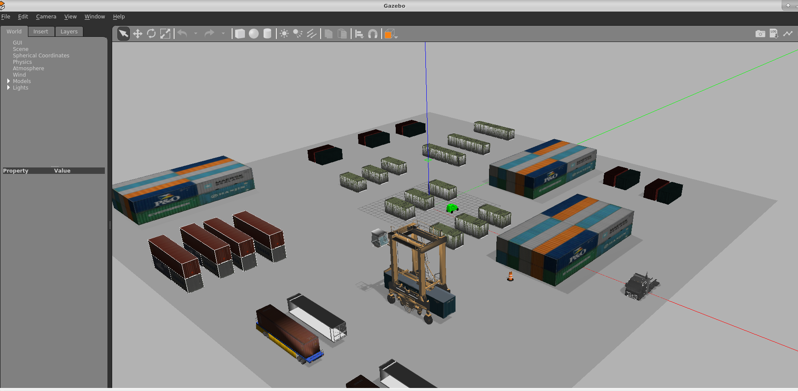

---

### `lane junction world`
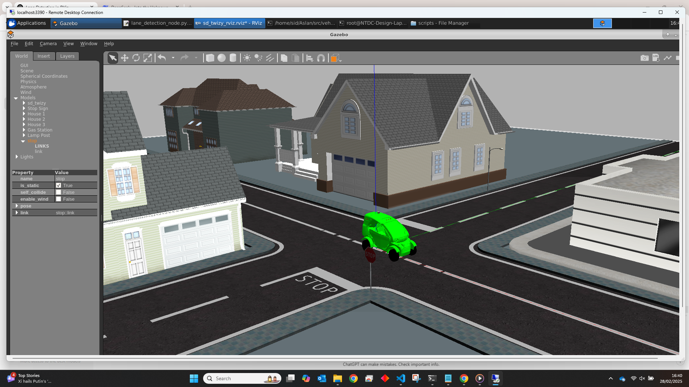

---

### `cloverleaf track world`
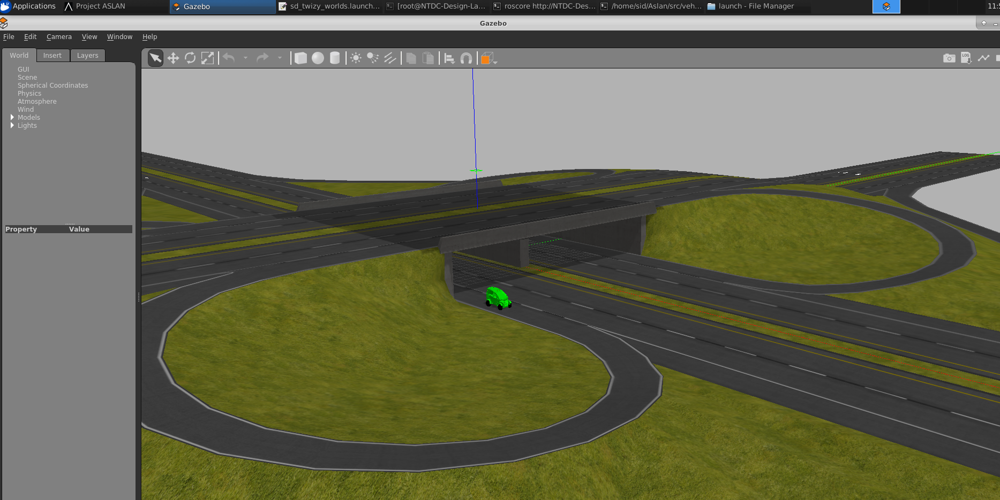

---

### `mcity world`
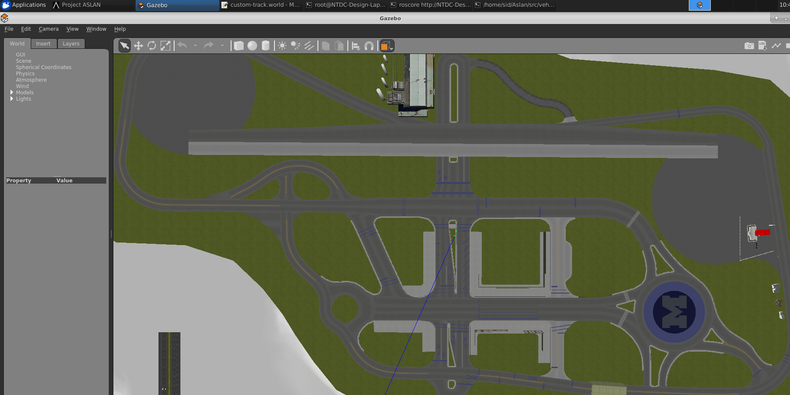


## Mapping (SLAM-based) 

Launch required processes to generate a 2D occupancy grid map using GMapping:

```bash
# Launch the simulation with the custom world
roslaunch sd_robot sd_twizy_worlds.launch world:=custom

# Convert pointcloud to 2D laser scan
roslaunch sd_robot pointcloud_to_laserscan.launch

# Launch GMapping for SLAM
roslaunch sd_robot gmapping.launch

```
<p>
  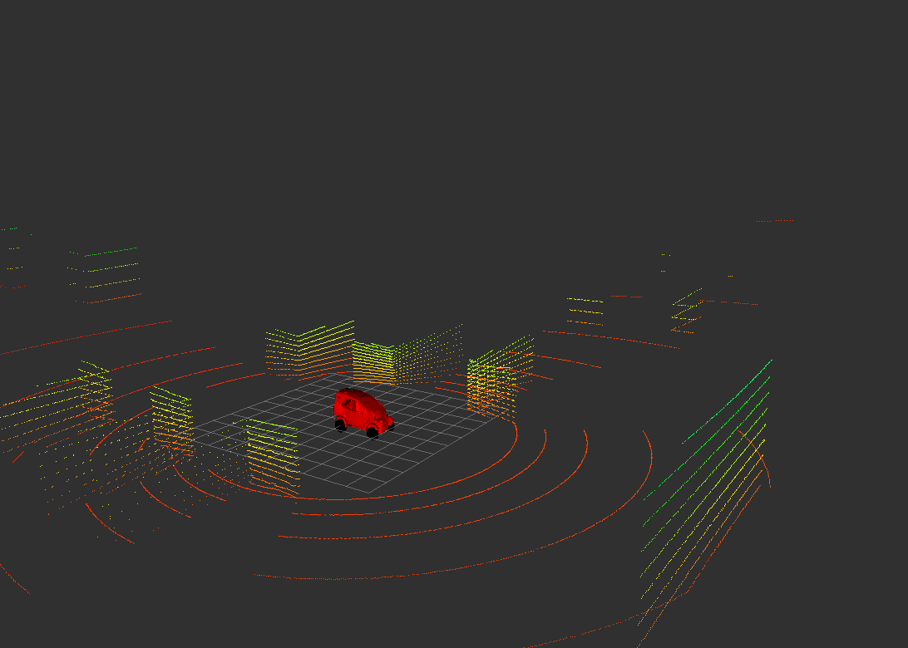
  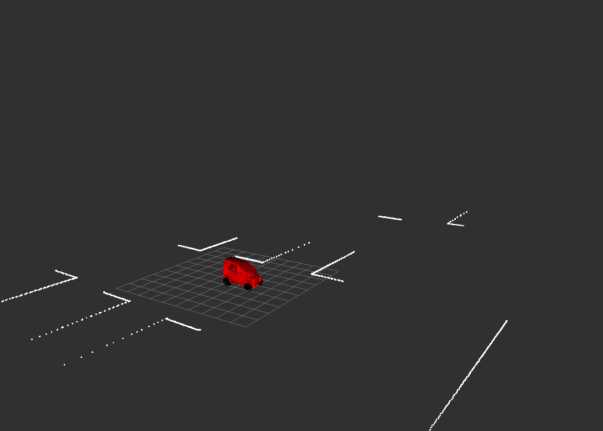
</p>

Control the simulated vehicle:

```bash
# Launch keyboard control
cd /home/sid/Aslan/src/vehicle_simulation/gazebo/sd_twizy_model/streetdrone_model/sd_control
./keyboardlaunch.sh

```
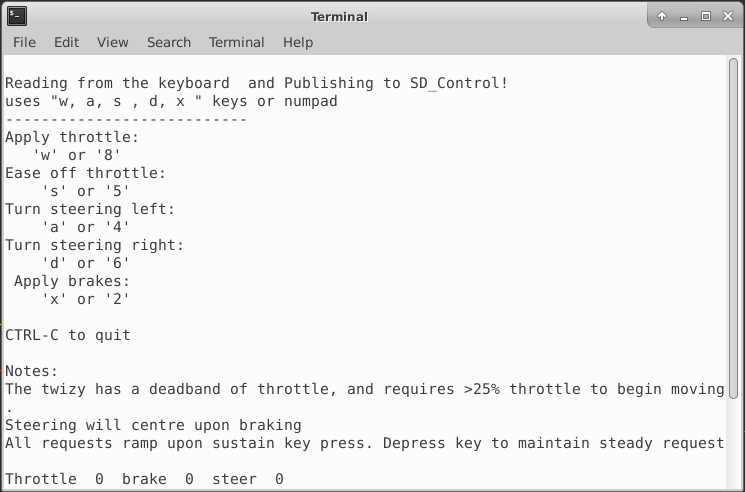


Save and load the map:

```bash
# Save the map to a file
rosrun map_server map_saver -f my_map

# Launch a map server using the saved map
rosrun map_server map_server largemap.yaml

```
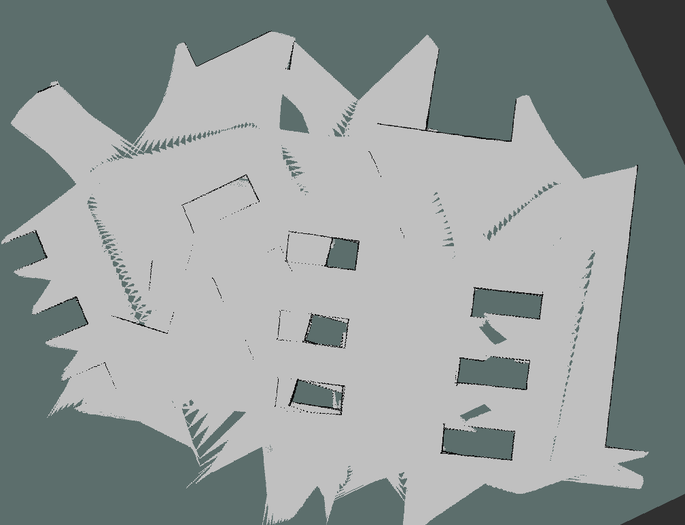


Visualize the TF tree:

```bash
rosrun rqt_tf_tree rqt_tf_tree

```
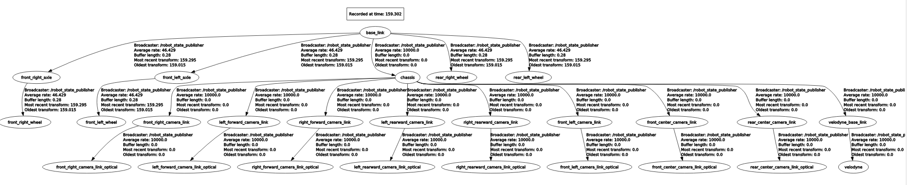

## Octomap and NDT Mapping (3D Mapping using pointclouds)
Use pointcloud data for volumetric 3D mapping:

```bash
# Start ROS core
roscore

# Publish a PCD file as a pointcloud
rosrun pcl_ros pcd_to_pointcloud /home/sid/Aslan/map.pcd _frame_id:=map _interval:=0.1

# Check available ROS nodes and topics
rosnode list
rostopic echo /cloud_pcd

# Launch Octomap mapping server
roslaunch octomap_server octomap_mapping.launch 

# Save the generated octomap to a file
rosrun octomap_server octomap_saver -f /path/to/save/your_map.ot

# Load an existing Octomap file
rosrun octomap_server octomap_server_node map.ot

```

### `NDTmapping`
<p>
  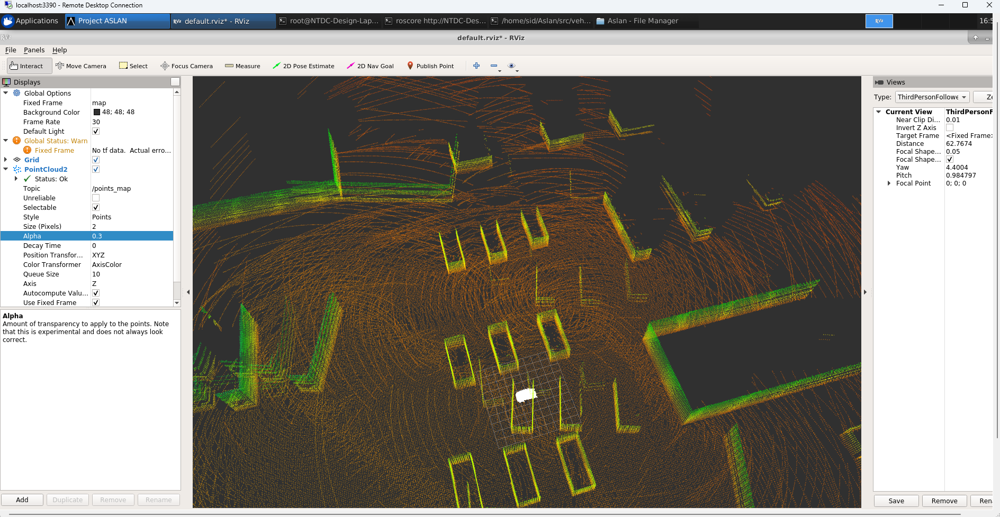
  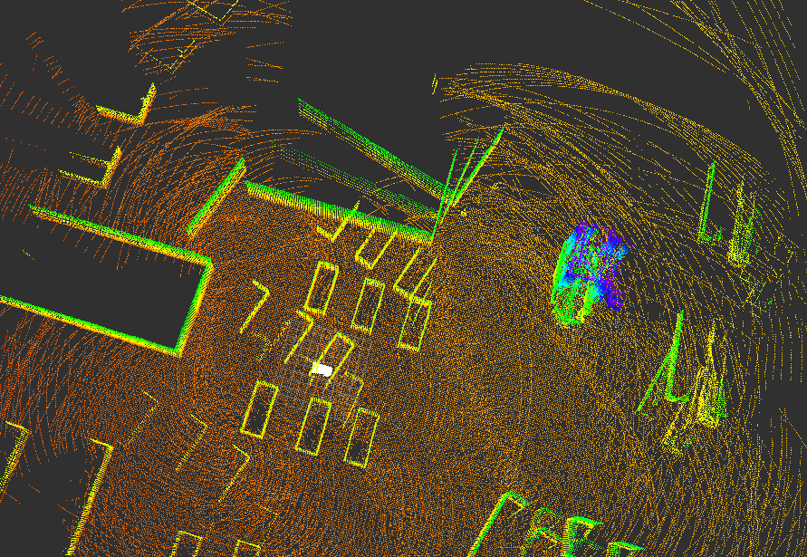
</p>

### `Octomap Views`

<p>
  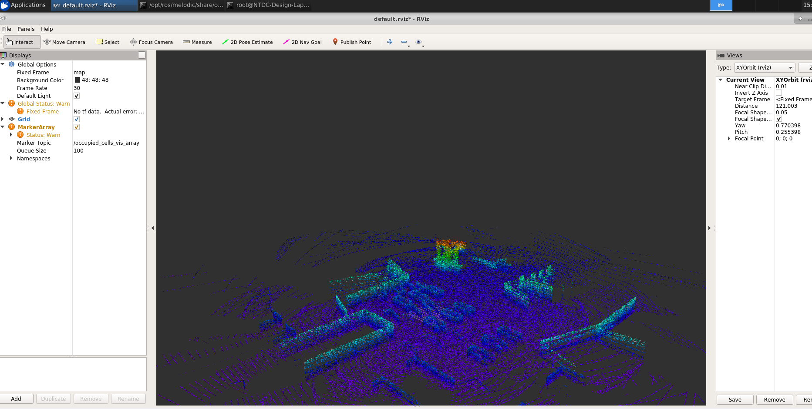
  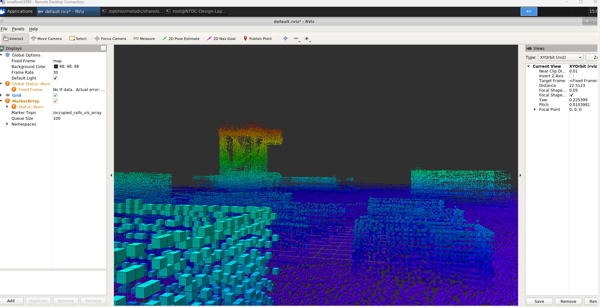
  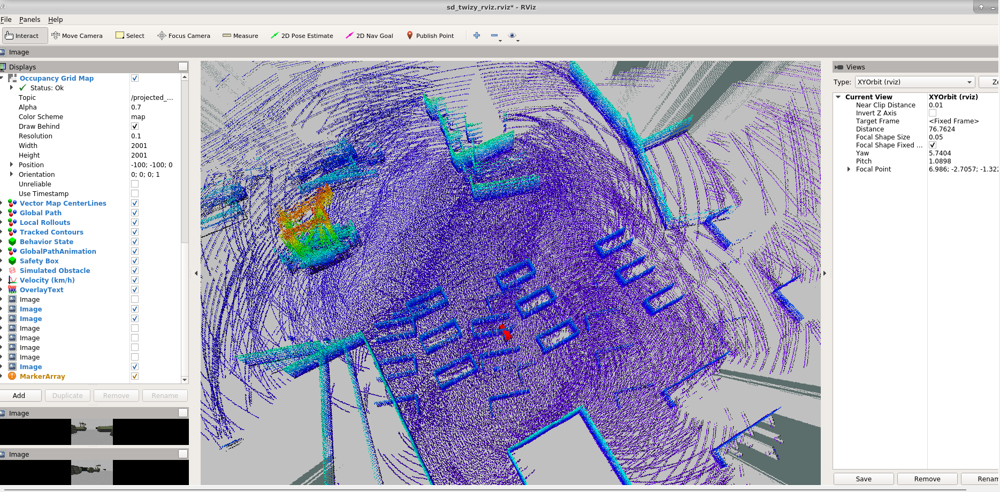
</p>


## Lane Detection
Set up the environment and run lane detection algorithms:

```bash
# Launch the simulation world with junction
roslaunch sd_robot sd_twizy_worlds.launch world:=car_1_junction

# Camera topic to use for lane detection
/sd_twizy/front_center_camera/image_raw

```
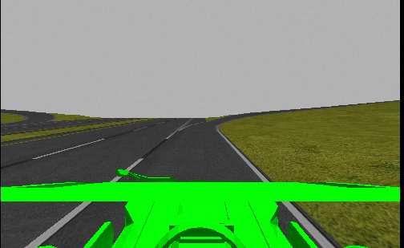

Start localizer and transformations:
```bash
# Launch GUI and localization tools
roslaunch aslan_gui baselink_to_localiser.launch

# Static transform between odom and base_link frames
rosrun tf static_transform_publisher 0 0 0 0 0 0 /odom /base_link 10

```

Preprocessing and running lane detection nodes:
```bash
# Convert file format to Unix line endings
dos2unix /home/sid/Aslan/src/vehicle_simulation/gazebo/sd_twizy_model/streetdrone_model/sd_robot/scripts/lane_detection_node.py

# Run lane detection node
rosrun sd_robot lane_detection_node.py

# Run the lane follower and waypoint follower
rosrun sd_robot lane_follower_node.py
rosrun sd_robot waypoint_follower_node.py

```


### `houghtransform lane lines`
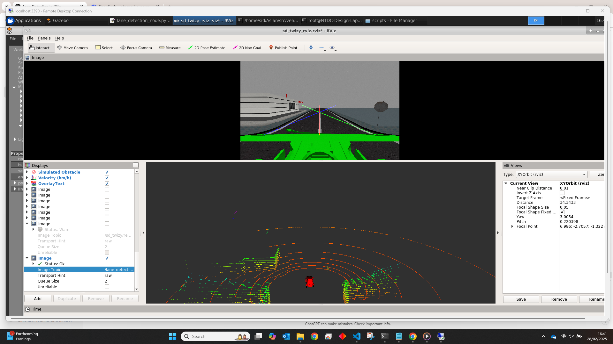

---

### `accurate_waypoint detection`
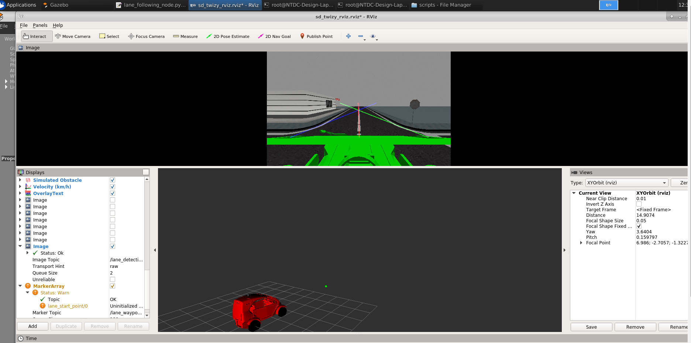

Monitor key topics:
```bash
# Monitor image processing frequency
rostopic hz /lane_detection/image

# Monitor waypoints and control signals
rostopic hz /lane_waypoints
rostopic hz /sd_control

```
#### /lane_detection/image

```bash
subscribed to [/lane_detection/image]
WARNING: may be using simulated time
average rate: 9.554
  min: 0.070s max: 0.131s std dev: 0.02091s window: 7
average rate: 9.240
  min: 0.070s max: 0.131s std dev: 0.01600s window: 14
average rate: 9.403
  min: 0.070s max: 0.140s std dev: 0.01793s window: 21
average rate: 8.796
  min: 0.070s max: 0.154s std dev: 0.02163s window: 27
average rate: 8.709
  min: 0.070s max: 0.154s std dev: 0.02254s window: 34
average rate: 8.611
  min: 0.070s max: 0.154s std dev: 0.02186s window: 40
average rate: 8.521
  min: 0.070s max: 0.154s std dev: 0.02082s window: 46
average rate: 8.532
  min: 0.070s max: 0.154s std dev: 0.02055s window: 50
```
#### /lane_waypoints
```bash
subscribed to [/lane_waypoints]
WARNING: may be using simulated time
average rate: 8.559
  min: 0.098s max: 0.148s std dev: 0.02015s window: 7
average rate: 8.276
  min: 0.070s max: 0.167s std dev: 0.02572s window: 13
average rate: 8.197
  min: 0.070s max: 0.167s std dev: 0.02527s window: 19
average rate: 8.112
  min: 0.070s max: 0.185s std dev: 0.02767s window: 26
average rate: 8.147
  min: 0.070s max: 0.185s std dev: 0.02806s window: 32
average rate: 8.149
  min: 0.070s max: 0.185s std dev: 0.02678s window: 39
average rate: 8.152
  min: 0.070s max: 0.185s std dev: 0.02613s window: 41
```
#### /sd_control
```bash
subscribed to [/sd_control]
WARNING: may be using simulated time
average rate: 9.960
  min: 0.097s max: 0.104s std dev: 0.00273s window: 6
average rate: 9.954
  min: 0.082s max: 0.114s std dev: 0.00677s window: 14
average rate: 9.995
  min: 0.082s max: 0.114s std dev: 0.00570s window: 21
average rate: 9.979
  min: 0.082s max: 0.114s std dev: 0.00515s window: 29
average rate: 9.989
  min: 0.082s max: 0.114s std dev: 0.00484s window: 37
average rate: 9.991
  min: 0.082s max: 0.114s std dev: 0.00450s window: 45
average rate: 9.994
  min: 0.081s max: 0.122s std dev: 0.00587s window: 52
average rate: 9.988
  min: 0.081s max: 0.122s std dev: 0.00558s window: 59
average rate: 9.988
  min: 0.081s max: 0.122s std dev: 0.00532s window: 68
average rate: 9.979
  min: 0.081s max: 0.122s std dev: 0.00533s window: 69
```

## Curve lane detection
`rosrun sd_robot curvelane_node.py`
<p>
  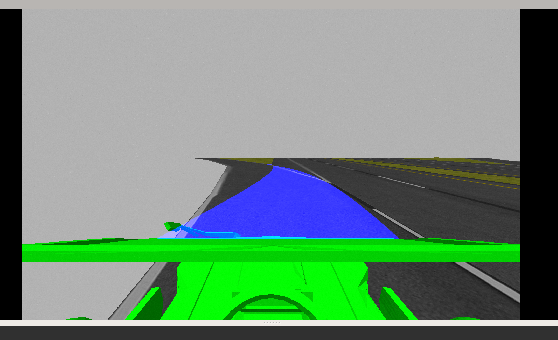
  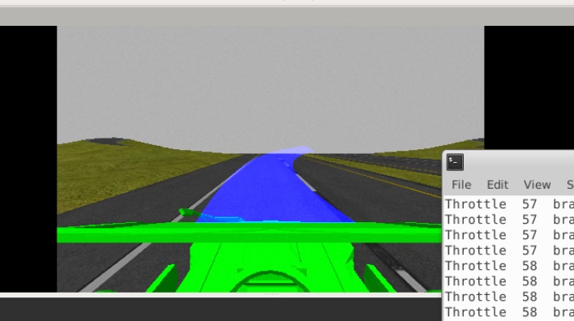
</p>

`rosrun sd_robot curve_lane_follower.py`

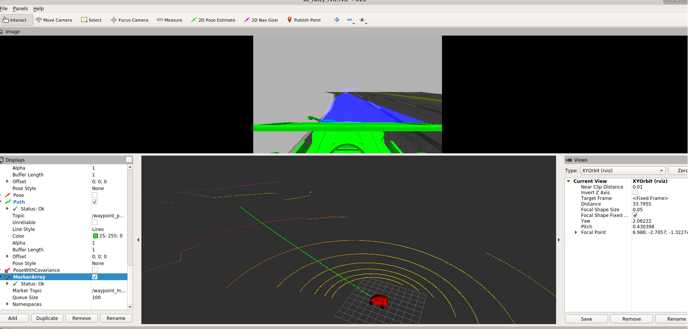

## Notes
* Ensure all necessary dependencies are sourced (source devel/setup.bash).
* Some files may require execution permissions or format conversion (chmod +x, dos2unix).
* Adjust paths if running on a different system or directory structure.
